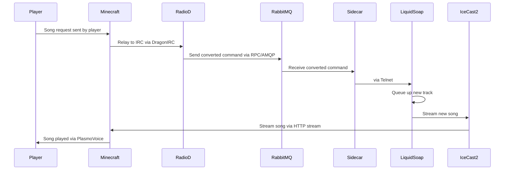

# Radio LizardNet

This repo contains a request control system for Radio LizardNet.

It consists of two projects - an IRC bot to interact with the users, and a sidecar application designed to sit alongside [Liquidsoap](https://www.liquidsoap.info/) to interface [via Telnet](https://www.liquidsoap.info/doc-2.2.4/server.html).

The two projects communicate via a RabbitMQ server.

