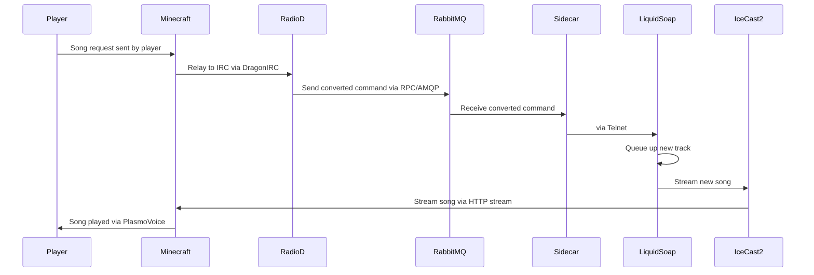

# Radio LizardNet

This repo contains a request control system for Radio LizardNet.

It consists of two projects - an IRC bot to interact with the users, and a sidecar application designed to sit alongside [Liquidsoap](https://www.liquidsoap.info/) to interface [via Telnet](https://www.liquidsoap.info/doc-2.2.4/server.html).

The two projects communicate via a RabbitMQ server.

```mermaid
sequenceDiagram
    Player->>Minecraft: Song request sent by player
    Minecraft->>RadioD: Relay to IRC via DragonIRC
    RadioD->>RabbitMQ: Send converted command via RPC/AMQP
    RabbitMQ->>Sidecar: Receive converted command
    Sidecar->>LiquidSoap: via Telnet
    LiquidSoap->>LiquidSoap: Queue up new track
    LiquidSoap->>IceCast2: Stream new song
    IceCast2->>Minecraft: Stream song via HTTP stream
    Minecraft->>Player: Song played via PlasmoVoice
```

### Logical components for podding up

* IRC Bot

* Liquidsoap
    * announcement generator tool (shared filesystem)
    * sidecar (shared network)

* Icecast2
  * metadata (shared disk)
  * silence (shared network)

### Config

Most stuff is configured via Yaml files. Some stuff is optionally configured via environment variables.

Available environment variables:
- IRC_SERVER_PASSWORD
- IRC_OPER_USER
- IRC_OPER_PASSWORD
- RABBITMQ_USERNAME
- RABBITMQ_PASSWORD